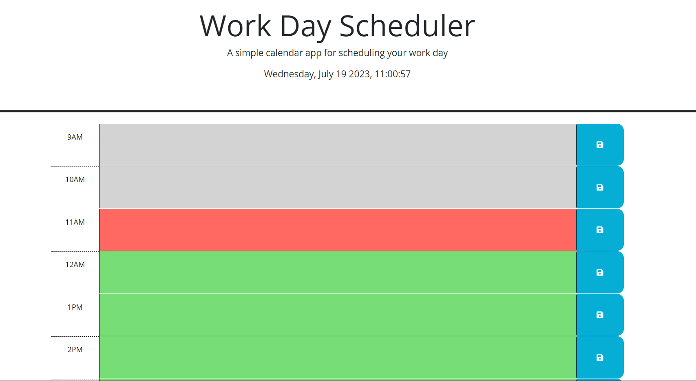

# Work Day Planner

## Description 
Work planner created for busy scedules. Add your task in the corresponding time slot, and click the save button on the right-hand side. All tasks will then be saved in local storage, information will remain in the time block even if refreshed!

Text blocks will show a color of grey, green, or red depending on if the task is in the past, present, or future. 

Grey stands for past.
Red stands for present.
Green stands for future.

## Links
Github Repo
https://github.com/livschif/Daily-planner

Daily Planner
https://livschif.github.io/Daily-planner

# Mockup

